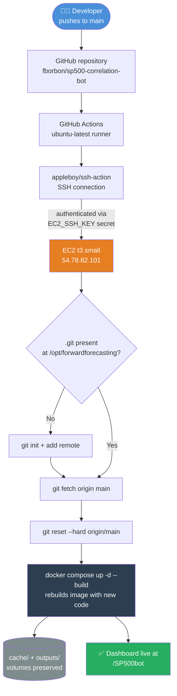

# SP500 Correlation Bot

Algorithmic trading bot for Interactive Brokers that predicts short-term 7-day price movements using Pearson correlations across the full S&P 500 universe. Both direct and inverse correlations are used as features for a Random Forest model, with the universe size configurable at runtime to always select the **N most valuable** companies by market cap. Price data is fetched free from Yahoo Finance; Interactive Brokers is only connected when live order placement is enabled. Every position is protected by a stop-loss / trailing-stop, and a portfolio-level max-drawdown circuit breaker halts new buys if losses accumulate — the strategy itself is validated by a walk-forward backtester that charges realistic commissions and slippage before any of this touches real money. A Streamlit dashboard visualises signals, fundamentals, correlation heatmaps, the backtest equity curve, and a weekly DCA simulator after each run.

**Main technologies:** Python · scikit-learn (Random Forest) · pandas · yfinance · ib-insync (Interactive Brokers API) · Streamlit · Plotly · pyarrow

**Monthly cost:** $0. Yahoo Finance data is free; IB connection is local. No cloud services, no paid APIs, no subscriptions required. Running on a local machine or a shared EC2 instance adds no incremental cost.

---

## Table of Contents

1. [Installation](#installation)
2. [Libraries](#libraries)
3. [Usage](#usage)
4. [Data Processing Pipeline](#data-processing-pipeline)
5. [Data Flow Diagram](#data-flow-diagram)
6. [Predictive Model](#predictive-model)
7. [File Structure](#file-structure)
8. [Key Configuration (`config.py`)](#key-configuration-configpy)
9. [Selecting Companies](#selecting-companies)
10. [Position Sizing](#position-sizing)
11. [Risk Management](#risk-management)
12. [Backtesting](#backtesting)
13. [Weekly DCA Simulator](#weekly-dca-simulator)
14. [Inverse Correlation Logic](#inverse-correlation-logic)
15. [Output Plots (`save_plots=True`)](#output-plots-saveplotstrue)
16. [Auditing](#auditing)
17. [CI/CD](#cicd)

---

## Installation

```bash
pip install ib_insync pandas numpy scikit-learn plotly kaleido requests yfinance streamlit nest_asyncio
```

- Interactive Brokers TWS or IB Gateway running locally (only needed to place orders)
- Port `7497` for paper trading (recommended for testing)
- Port `7496` for live trading (use with caution)

> **Price data** is fetched from Yahoo Finance via `yfinance` (free, no IB needed).
> IB is only connected when `execute_trades=True` to place the actual orders.

---

## Libraries

| Library | Version | Role in this project |
|---|---|---|
| **pandas** | 3.0.2 | Core data structure throughout the pipeline. All price matrices, returns, signals, and fundamentals are `DataFrame` objects. Used for `pct_change()`, `corr()`, CSV/Parquet I/O, and data alignment. |
| **numpy** | 2.4.4 | Numerical operations in the model and charting layers: cumulative-return arrays, `polyfit` trend lines, `corrcoef` for R² computation in charts, and array slicing for downsampling. |
| **scikit-learn** | 1.8.0 | Provides the `RandomForestRegressor` that predicts 7-day returns and `TimeSeriesSplit` for walk-forward cross-validation. The only ML framework used. |
| **yfinance** | 1.3.0 | Primary market data source (no API key needed). Used to download close prices, daily volume, market capitalisations, and per-ticker fundamental metadata (`Ticker.info`). |
| **plotly** | 6.7.0 | All charts — correlation heatmaps, price-series, market-cap bars, volume series, cumulative returns, and prediction scatter plots — are built with Plotly's `graph_objects` and `make_subplots`. |
| **kaleido** | 0.2.1 | Renders Plotly figures to static PNG files without a browser. Pinned to 0.2.1 because this version bundles its own renderer and does not require Chrome/Chromium. |
| **streamlit** | 1.57.0 | Powers the interactive web dashboard (`dashboard.py`). Renders signals tables, fundamentals, price charts, and correlation heatmaps from the output CSVs in a browser. |
| **ib-insync** | 0.9.86 | Python wrapper for the Interactive Brokers TWS/Gateway API. Used exclusively when `execute_trades=True` to qualify contracts, retrieve portfolio value, and place market or limit orders. |
| **requests** | 2.33.1 | HTTP client used to scrape the Wikipedia S&P 500 constituents page and fetch company metadata (name, sector, founding year). |
| **beautifulsoup4 / lxml** | 4.14.3 / 6.1.0 | HTML parsers invoked indirectly via `pandas.read_html()` when extracting the S&P 500 table from Wikipedia. `lxml` is the fast back-end parser. |
| **pyarrow** | 24.0.0 | Parquet serialisation for the incremental price and volume caches (`cache/prices_cache.parquet`, `cache/volume_cache.parquet`). Enables column-efficient storage and fast partial reads. |
| **joblib** | 1.5.3 | Used internally by scikit-learn to parallelise tree construction across all available CPU cores (`n_jobs=-1`). No direct calls in the project code. |
| **nest_asyncio** | — | Patches Python's event loop to allow `ib_insync`'s async calls inside Jupyter notebooks. Only needed when running `Main.ipynb`. |

> **Note on AI technologies:** This project uses only classical machine learning (Random Forest) from scikit-learn. No generative AI, large language models, retrieval-augmented generation, chatbots, speech-to-text, image diffusion, or agentic AI frameworks are used.

---

## Usage

```bash
# Demo mode — no IB required, synthetic data with inverse correlations
python main.py demo

# Top 50 companies by market cap, signals only
python main.py signals 50

# Top 100 companies, paper trading
python main.py paper 100

# Full S&P 500 (~503 tickers), paper trading
python main.py paper

# Live trading — real money, requires manual confirmation
python main.py live 50

# Walk-forward backtest — top 20 tickers, net of commissions/slippage
python main.py backtest 20
```

Or use `Main.ipynb` in Jupyter — set `n_tickers` and `mode` in the run cell.

### Dashboard

After running the bot, launch the dashboard to explore results interactively:

```bash
streamlit run dashboard.py
```

Opens in your browser at `http://localhost:8501`. Nine tabs:
- **Signals** — colour-coded BUY/SELL/HOLD table
- **Fundamentals** — 10-metric scoring table with likelihood_pct highlighted
- **Mkt Cap / Prices / Volume / Returns / Correlation** — all charts from `General/` and `Correlation_method/`
- **Backtest** — walk-forward equity curve vs buy-and-hold, from the latest `python main.py backtest` run
- **Simulator** — weekly DCA calculator (fixed EUR amount into an S&P 500 ETF over N years)

---

## Data Processing Pipeline

The bot executes a fixed seven-stage pipeline on each run.

### Stage 1 — Universe Selection (`analysis/universe.py`)

The S&P 500 constituent list is scraped from Wikipedia's *List of S&P 500 companies* HTML table using `requests` + `pandas.read_html`. When a specific `n` is requested, `yfinance.fast_info['market_cap']` is called in parallel (10 threads) for all ~503 tickers to obtain real-time market capitalisations. Results are sorted descending and only the top-N are kept. Market caps are cached in `cache/market_caps_cache.json` with a 24-hour TTL to avoid redundant network calls on repeated runs.

### Stage 2 — Data Ingestion (`broker/data.py`)

Historical daily **close prices** and **trading volume** are downloaded in a single `yfinance.download()` batch call (all tickers at once, much faster than one-by-one). Data is persisted in Parquet format (`cache/prices_cache.parquet`, `cache/volume_cache.parquet`). On subsequent runs only the new days are fetched (incremental update), with a 15-day overlap window to capture dividend/split adjustments. `HISTORY_DAYS` controls how many trading days are retained for analysis.

When `execute_trades=True`, the pipeline additionally connects to Interactive Brokers via `ib_insync` to retrieve the portfolio's net liquidation value and to place orders.

### Stage 3 — Correlation Analysis (`analysis/correlations.py`)

Daily percentage returns are computed from the close-price DataFrame using `pct_change()`. A full **Pearson correlation matrix** is then calculated across all tickers with `DataFrame.corr(method='pearson')`. This produces an N×N symmetric matrix where each cell holds the linear correlation coefficient r ∈ [−1, 1] between the daily return streams of two stocks. Both positive (co-moving) and negative (counter-moving) relationships are preserved.

### Stage 4 — Prediction Model (`analysis/model.py`)

For each target ticker the model:

1. **Selects predictors** — any ticker whose absolute Pearson r with the target is ≥ `MIN_CORRELATION` (default 0.50).
2. **Constructs the feature matrix** — `X` = daily returns of all selected predictors; `y` = N-day cumulative return of the target starting from the same day (`PREDICTION_DAYS = 7`).
3. **Cross-validates** — `TimeSeriesSplit(n_splits=3)` creates three non-overlapping, chronologically ordered train/validation splits. The mean R² across splits is the model's confidence score.
4. **Trains the final model** — a `RandomForestRegressor` is re-fit on the full available history.
5. **Predicts** — the model predicts the 7-day forward return from the most recent feature vector.

See the [Predictive Model](#predictive-model) section for full details.

### Stage 5 — Fundamental Analysis (`analysis/fundamentals.py`)

Ten fundamental metrics are fetched per ticker from `yfinance.Ticker.info` using 10 parallel threads (with 2 retries each). Each metric is scored against calibrated thresholds and multiplied by its weight; scores are summed to a `likelihood_pct` (0–100) representing the probability that the stock price will be higher in 12 months. The 10 metrics and their weights are:

| Metric | Weight | Rationale |
|---|---|---|
| Revenue growth | 15 | Growing top line |
| Gross margin | 10 | Pricing power / moat |
| Operating margin | 10 | Operational efficiency |
| Free cash flow | 10 | Real cash generation |
| Current ratio | 10 | Short-term solvency |
| Debt-to-equity | 10 | Leverage risk |
| P/E ratio | 10 | Valuation vs earnings |
| PEG ratio | 10 | Valuation vs growth |
| Earnings growth | 10 | Profit momentum |
| P/B ratio | 5 | Valuation vs book value |

### Stage 6 — Signal Generation (`analysis/signals.py`)

Signals are generated by applying threshold rules to the model's predicted return and confidence score:

| Condition | Signal |
|---|---|
| R² < `MIN_R2` (0.01) | `LOW_CONFIDENCE` |
| predicted return > `BUY_THRESHOLD` (+1%) | `BUY` |
| predicted return < `SELL_THRESHOLD` (−10%) | `SELL` |
| otherwise | `HOLD` |
| insufficient predictors | `INSUF_DATA` |

Each signal row also lists the top-5 predictors split into `direct_top5_predictors` (r > 0) and `inverse_top5_predictors` (r < 0).

### Stage 7 — Reporting & Export (`reporting/`)

`report.py` prints the signal table to the console and saves `signals.csv`. `charts.py` renders nine PNG files (see [Output Plots](#output-plots-save_plotstrue)). Fundamental data is saved to `fundamentals.csv`. All CSV and PNG outputs are written into a timestamped `outputs/YYYY-MM-DD_HH-MM/` folder. The Streamlit dashboard reads these files to render the interactive UI.

---

## Data Flow Diagram

```mermaid
flowchart TD
    CLI([Start · main.py / Main.ipynb])

    CLI --> A

    subgraph A["1 · Universe Selection  (analysis/universe.py)"]
        A1[Wikipedia HTML scrape\n~503 S&P 500 tickers] --> A3
        A2["yfinance market caps\n(cache/market_caps_cache.json · 24 h TTL)"] --> A3
        A3[Sort by market cap → select top-N]
    end

    A --> B

    subgraph B["2 · Data Ingestion  (broker/data.py)"]
        B1["yfinance batch download → Close prices\n(cache/prices_cache.parquet · incremental)"]
        B2["yfinance batch download → Daily volume\n(cache/volume_cache.parquet · incremental)"]
    end

    B --> C

    subgraph C["3 · Correlation Analysis  (analysis/correlations.py)"]
        C1[daily_returns = prices.pct_change] --> C2
        C2["Pearson correlation matrix  (N × N)"]
    end

    C --> D

    subgraph D["4 · Prediction Model  (analysis/model.py)  · loop per ticker"]
        D1["Filter predictors  |r| ≥ 0.50"] --> D2
        D2["X = predictor daily returns\ny = 7-day cumulative return"] --> D3
        D3["TimeSeriesSplit  n = 3 folds\ncross-validate → mean R²"] --> D4
        D4["Final fit: RandomForestRegressor\n200 trees · max_depth = 4 · min_samples_leaf = 10"] --> D5
        D5["Predict next 7-day return  +  corr_signs"]
    end

    A --> E

    subgraph E["5 · Fundamental Analysis  (analysis/fundamentals.py)  · parallel"]
        E1["yfinance.Ticker.info · 10 threads · 2 retries"] --> E2
        E2["10 raw metrics: P/E · PEG · P/B\nmargins · FCF · current ratio · D/E · growth"] --> E3
        E3["Weighted score → likelihood_pct  (0–100)"]
    end

    D --> F

    subgraph F["6 · Signal Generation  (analysis/signals.py)"]
        F1{"R² ≥ MIN_R2 = 0.01?"}
        F1 -->|No| F2[LOW_CONFIDENCE]
        F1 -->|Yes| F3{"predicted return"}
        F3 -->|"> +1%"| F4[BUY]
        F3 -->|"< −10%"| F5[SELL]
        F3 -->|otherwise| F6[HOLD]
    end

    F --> G
    E --> G
    C --> G
    B --> G

    subgraph G["7 · Reporting  (reporting/charts.py · report.py)"]
        G1["signals.csv · fundamentals.csv\nprices.csv · volume.csv"]
        G2["PNG charts\nGeneral/  ·  Correlation_method/"]
    end

    G --> H[("Streamlit Dashboard\ndashboard.py · localhost:8501")]

    F -->|"execute_trades = True"| IB[("Interactive Brokers\nbroker/orders.py\nMarket orders")]
```



---

## Predictive Model

### Algorithm: Random Forest Regressor

`predict_price()` (`analysis/model.py`) uses scikit-learn's `RandomForestRegressor`. A Random Forest builds many independent decision trees on random sub-samples of the training data and averages their predictions. This ensemble approach provides several properties that make it well-suited to this task:

- **Non-linearity** — captures interactions between correlated stocks that a simple linear regression cannot (e.g. a pair with r = 0.70 may only be predictive when a third stock is also up).
- **Scale invariance** — decision trees split on rank order, not magnitude, so all predictor returns (which vary in scale) feed directly into the model without normalisation or `StandardScaler`.
- **Outlier robustness** — averaging over 200 trees smooths out the effect of extreme return days that would skew a linear model.
- **Implicit feature selection** — trees with low-information splits are averaged away; correlated predictors compete for splits rather than inflating coefficients as in OLS regression.

### Why not a linear model?

Stock-to-stock return relationships are conditionally nonlinear. Two stocks that are highly correlated on average may decorrelate during sector rotations, earnings seasons, or macro shocks. A forest of shallow trees (`max_depth=4`) captures these regime-dependent patterns while the depth limit prevents overfitting to noise.

### Configuration

| Parameter | Value | Effect |
|---|---|---|
| `n_estimators` (cross-val) | 100 | Faster CV pass; enough trees for a stable R² estimate |
| `n_estimators` (final fit) | 200 | Double the trees for the production prediction |
| `max_depth` | 4 | Limits each tree to 4 decision levels — shallow trees generalise better on financial time-series |
| `min_samples_leaf` | 10 | A leaf must represent at least 10 observations; prevents the model from memorising micro-patterns in small training sets |
| `random_state` | 42 | Reproducible results across runs |
| `n_jobs` | −1 | Uses all available CPU cores to build trees in parallel |

### Walk-Forward Cross-Validation

`TimeSeriesSplit(n_splits=3)` is used instead of the standard k-fold to respect temporal order:

```
Fold 1:  [train ───────]  [val ─]
Fold 2:  [train ──────────]  [val ─]
Fold 3:  [train ─────────────]  [val ─]
```

Each fold extends the training window forward in time; the validation set is always *after* the training set. This prevents look-ahead bias — the model is never evaluated on data that preceded its training period. The mean R² across the three folds is the confidence score reported in `model_r2`.

### Feature Engineering

The target label is the **cumulative return** of the target stock over the next `PREDICTION_DAYS` (default 7) trading days:

```python
y[i] = sum(daily_returns[i : i + 7])   # ≈ 7-day total return
```

Features are the contemporaneous daily returns of all predictor stocks. No explicit technical indicators (RSI, MACD, etc.) are computed — the model learns patterns from the cross-sectional return structure alone.

---

## File Structure

```
V3/
├── config.py               # All constants + OUTPUTS_DIR path
├── main.py                 # run_bot(n_tickers) + CLI entry point
├── demo.py                 # run_demo() — synthetic data, no IB connection needed
│
├── broker/
│   ├── __init__.py
│   ├── connection.py       # connect_ib(), get_contract(), nest_asyncio fix
│   ├── data.py             # fetch_prices() via IB; fetch_prices_free() via yfinance
│   ├── orders.py           # execute_order(), close_position(), calculate_position_size()
│   └── risk.py             # stop-loss / trailing-stop / max-drawdown guard,
│                           # persisted to cache/risk_state.json
│
├── analysis/
│   ├── __init__.py
│   ├── universe.py         # get_sp500_tickers(n) → (tickers, caps); fetch_market_caps();
│   │                       # fetch_company_metadata() — name, sector, founded, cap ($B)
│   ├── correlations.py     # compute_correlations(), get_top_correlated_pairs(),
│   │                       # get_top_inverse_pairs()
│   ├── fundamentals.py     # fetch_fundamentals(), score_fundamentals(),
│   │                       # save_fundamentals_csv() — 10-metric scoring → likelihood_pct
│   ├── model.py            # predict_price() — RandomForestRegressor + TimeSeriesSplit;
│   │                       # returns corr_signs, y_actual, y_predicted
│   ├── signals.py          # generate_signals() — BUY/SELL/HOLD with
│   │                       # direct_top5_predictors / inverse_top5_predictors
│   ├── backtest.py         # run_backtest() — walk-forward, no-lookahead replay with
│   │                       # commissions/slippage + the same risk.py rules
│   └── simulator.py        # simulate_weekly_dca() — weekly EUR→ETF DCA calculator
│                           # for the dashboard's Simulator tab
│
├── reporting/
│   ├── __init__.py
│   ├── charts.py           # plot_correlation_matrix(); plot_price_series();
│   │                       # plot_market_cap_bars(); plot_prediction_analysis()
│   └── report.py           # print_report() — direct (↑↑) and inverse (↑↓) pair
│                           # sections; save_signals_csv()
│
├── cache/                  # Local data cache — git-ignored contents
│   ├── prices_cache.parquet
│   ├── volume_cache.parquet
│   ├── market_caps_cache.json
│   ├── risk_state.json     # entry/peak prices + equity peak, written by broker/risk.py
│   └── backtest_latest/    # written by `python main.py backtest` — read by the dashboard
│       ├── equity_curve.csv
│       ├── trades.csv
│       └── metrics.json
│
├── outputs/                # Generated files — git-ignored contents
│   ├── 2026-05-07_14-30/   # timestamped folder per run (YYYY-MM-DD_HH-MM)
│   │   ├── signals.csv
│   │   ├── prices.csv          # raw close prices — used by dashboard for interactive charts
│   │   ├── fundamentals.csv
│   │   ├── General/
│   │   │   ├── price_series_market-cap.png
│   │   │   ├── price_series_stock-price-absolute.png
│   │   │   ├── price_series_normalized-return.png
│   │   │   ├── market_cap_bars.png
│   │   │   ├── market_cap_series_absolute.png
│   │   │   ├── market_cap_series_normalized.png
│   │   │   ├── volume_series_absolute.png
│   │   │   ├── volume_series_normalized.png
│   │   │   └── cumulative_returns.png
│   │   └── Correlation_method/
│   │       ├── correlation_matrix.png
│   │       └── analysis_{TICKER}.png
│   └── demo_signals.csv    # demo mode outputs (no timestamp)
│
├── Main.ipynb              # Jupyter entry point
└── dashboard.py            # Streamlit dashboard
```

---

## Key Configuration (`config.py`)

| Variable | Default | Description |
|---|---|---|
| `IB_HOST` | `127.0.0.1` | TWS / IB Gateway host |
| `IB_PORT` | `7497` | 7497 = paper, 7496 = live |
| `HISTORY_DAYS` | `99999` | Trading days of history (99999 = use full cache) |
| `PREDICTION_DAYS` | `7` | Forecast horizon (days) |
| `MIN_CORRELATION` | `0.50` | Minimum absolute Pearson r to use a predictor (direct or inverse) |
| `MIN_R2` | `0.01` | Minimum R² to trust a signal |
| `BUY_THRESHOLD` | `0.01` | Predicted return > 1% → BUY |
| `SELL_THRESHOLD` | `-0.10` | Predicted return < −10% → SELL |
| `MAX_POSITION_PCT` | `0.10` | Max 10% of portfolio per position |
| `TOP_N_HIGHLIGHT` | `15` | Companies highlighted in price series and bar charts |
| `FALLBACK_PORTFOLIO` | `1000.0` | Portfolio value used when IB does not return NetLiquidation |
| `FALLBACK_TICKERS` | top 20 | Used when all online sources fail |
| `PRICE_CACHE_OVERLAP_DAYS` | `15` | Calendar days re-fetched on incremental update (for adjustments) |
| `MCAP_CACHE_MAX_AGE_HOURS` | `24` | Hours before market-cap snapshot is considered stale |
| `STOP_LOSS_PCT` | `0.08` | Close a position 8% below its entry price |
| `TRAILING_STOP_PCT` | `0.05` | Close a position 5% below its peak price since entry |
| `MAX_DRAWDOWN_PCT` | `0.15` | Halt new BUY orders once equity drawdown from peak exceeds 15% |
| `BACKTEST_START_CAPITAL` | `10000.0` | Simulated starting capital for `python main.py backtest` |
| `BACKTEST_TRANSACTION_COST_PCT` | `0.0010` | Commission per simulated fill (10 bps) |
| `BACKTEST_SLIPPAGE_PCT` | `0.0005` | Slippage per simulated fill (5 bps) |
| `BACKTEST_REBALANCE_DAYS` | `7` | Trading days between backtest re-scoring points |
| `SIM_WEEKLY_AMOUNT_EUR` | `100.0` | Default weekly contribution in the DCA Simulator tab |
| `SIM_YEARS` | `2` | Default lookback window in the DCA Simulator tab |
| `SIM_BENCHMARK_TICKER` | `SPY` | ETF used as the S&P 500 proxy in the DCA Simulator |

---

## Selecting Companies

`get_sp500_tickers(n)` fetches the **N most valuable** S&P 500 companies at runtime:

| Source | Order | Used when |
|---|---|---|
| Wikipedia + yfinance sort | By actual market cap ✓ | Always (when `n` is specified) |
| Wikipedia only | Alphabetical | `n=None` (full universe) |
| `FALLBACK_TICKERS` | Hardcoded top-20 | Wikipedia unavailable, or `n_tickers='FALLBACK_TICKERS'` |

When `n` is specified, all ~503 Wikipedia tickers are fetched then sorted by real yfinance market caps (~30s) before slicing to top N. Plots also re-sort by market cap so `price_series.png` and `market_cap_bars.png` always show the correct companies.

`n_tickers` accepts three types:
- **`int`** — top N companies by market cap (e.g. `50`)
- **`None`** — full S&P 500 (~503 tickers)
- **`'FALLBACK_TICKERS'`** — hardcoded top-20 list, no web request

---

## Position Sizing

The spend per order is calculated in `broker/orders.py`:

```
portfolio_value  ×  MAX_POSITION_PCT  ×  signal_strength
```

- `MAX_POSITION_PCT = 0.10` → max 10% of portfolio per position
- `signal_strength = min(1.0, model_r2)` → scales down if R² < 1.0

Example — $100,000 portfolio, buying a $300 stock with R²=0.6:
```
max_value = 100,000 × 0.05 × 0.6 = $3,000
quantity  = int(3,000 / 300)      = 10 shares
```

To change the spend amount, adjust `MAX_POSITION_PCT` or `FALLBACK_PORTFOLIO` in `config.py`.

---

## Risk Management

Position sizing alone does not stop a loss from running — it only caps the size of the initial bet. `broker/risk.py` adds three independent guards, all evaluated at the start of every trading run (`execute_trades=True`) before any new order is placed:

| Guard | Config | Behaviour |
|---|---|---|
| **Stop-loss** | `STOP_LOSS_PCT = 0.08` | Closes a position if its price falls 8% below the recorded entry price. |
| **Trailing stop** | `TRAILING_STOP_PCT = 0.05` | Closes a position if its price falls 5% below the highest price observed since entry — locks in gains on winners instead of only protecting against losses. |
| **Max drawdown (circuit breaker)** | `MAX_DRAWDOWN_PCT = 0.15` | If portfolio equity has fallen 15% from its all-time run peak, **new BUY orders are halted for that run** (SELL orders and stop-loss closes still execute — de-risking is never blocked). |

Entry price, peak price, and the portfolio equity peak are persisted to `cache/risk_state.json` between runs (each cron invocation is a fresh process). The flow inside `main.py`'s `execute_trades` block is:

1. Load `risk_state.json`.
2. Check every open position's current price against its stop-loss / trailing-stop; close any breach immediately.
3. Recompute portfolio value, update the equity peak, and evaluate the drawdown circuit breaker.
4. Walk the BUY/SELL signal table — BUY orders are skipped entirely if the circuit breaker is active; every filled BUY registers its entry price for future stop-loss checks.
5. Save `risk_state.json`.

---

## Backtesting

`analysis/backtest.py` answers the question the live pipeline can't: *would this strategy actually have made money, net of costs?* It replays history day by day rather than fitting once on "all data up to today":

- At every rebalance point (`BACKTEST_REBALANCE_DAYS = PREDICTION_DAYS`, i.e. weekly) the model is fit and scored using **only price history available up to that day** — no lookahead into the future.
- Every simulated fill pays `BACKTEST_TRANSACTION_COST_PCT` (10 bps commission) and `BACKTEST_SLIPPAGE_PCT` (5 bps slippage), applied against the strategy, not in its favour.
- The same stop-loss, trailing-stop, and max-drawdown rules from [Risk Management](#risk-management) run inside the simulation, so the backtest tests the whole system, not just the raw model.
- Positions are fully liquidated and rebuilt at each rebalance from the fresh signal set; an equal-weight buy-and-hold of the same universe is tracked in parallel as the benchmark.

Run it with:
```bash
python main.py backtest 20   # top 20 tickers by market cap
```

Output (`cache/backtest_latest/` — deliberately not under `outputs/`, where the dashboard treats the newest folder as the latest run and the daily cron deletes all but the newest):
- `equity_curve.csv` — daily strategy equity vs. the buy-and-hold benchmark
- `trades.csv` — every simulated fill with reason (`SIGNAL` / `STOP_LOSS` / `TRAILING_STOP` / `REBALANCE`) and P&L
- `metrics.json` — total return, CAGR, Sharpe ratio, max drawdown, win rate, trade count, benchmark return

The dashboard's **Backtest** tab reads these files directly. `fetch_prices_cached()` returns each ticker's full history back to its IPO, so the walked window is capped by `BACKTEST_LOOKBACK_DAYS` (default ~2 trading years, plus a `BACKTEST_MIN_HISTORY_DAYS` warm-up) to keep runtime bounded — without this cap a `python main.py backtest` run would try to replay 60+ years of history. Even bounded, this is compute-heavy: each rebalance fits one Random Forest (+ 3 walk-forward CV folds) *per ticker*, so the default 2-year/20-ticker run takes on the order of 20–40 minutes depending on the host. This is an offline analysis tool meant to be run occasionally (e.g. after a config change) and left to finish in the background — not part of the live trading path, and not something the dashboard triggers on page load. Pass a smaller `n_tickers` for a quicker check.

---

## Weekly DCA Simulator

The dashboard's **Simulator** tab is a separate, much simpler tool: not a backtest of the bot's own signals, but a plain dollar-cost-averaging calculator — *"what if I had just invested a fixed amount every week?"* It simulates contributing `SIM_WEEKLY_AMOUNT_EUR` (default €100) every week into `SIM_BENCHMARK_TICKER` (default `SPY`, the tradable S&P 500 ETF proxy) over `SIM_YEARS` (default 2), converting each contribution at that week's historical EUR/USD rate (`analysis/simulator.py`, via `yfinance`). No fees, spread, or tax are modelled — it exists purely as an always-available, honest baseline to compare the bot's own performance against passive investing, and is adjustable live from the tab (weekly amount, years) without touching `config.py`.

---

## Inverse Correlation Logic

Stocks with absolute Pearson r ≥ 0.50 relative to the target are included as predictors regardless of sign. The Random Forest assigns the correct weight to each — inverse correlators (r < 0) contribute negatively to the prediction. The report labels them **↓ inverso** and lists the most negatively correlated pairs under **↑↓ TOP 5 PARES CORRELACIÓN INVERSA**.

---

## Output Plots (`save_plots=True`)

**`Correlation_method/correlation_matrix.png`** — Pearson correlation heatmap for all analyzed tickers.

**`Correlation_method/analysis_{TICKER}.png`** — generated for the top 5 signals by predicted return:
- **Left** — scatter of actual vs predicted cumulative returns (1:1 aspect ratio) with R² trend line.
- **Right** — normalized price time series of the target + its top 5 correlated tickers. Direct correlators as solid lines, inverse correlators as dashed lines.

**`General/price_series_market-cap.png`** — Two-subplot price time series. Top 15 by market cap in distinct colors; all others in light gray.
- **Top subplot** — normalized prices (base = 100).
- **Bottom subplot** — absolute close prices ($).

**`General/price_series_stock-price-absolute.png`** — Same layout but top 15 highlighted by highest last close stock price ($).

**`General/price_series_normalized-return.png`** — Same layout but top 15 highlighted by highest normalized return (best performers: largest % gain from the start of the history window).

**`General/market_cap_bars.png`** — Two-subplot bar chart for top 15 and bottom 15 companies by market cap.
- **Top subplot** — last closing stock price ($).
- **Bottom subplot** — market capitalization ($B / $T) from yfinance.

**`General/market_cap_series_absolute.png`** / **`market_cap_series_normalized.png`** — Market cap time series for top 15 companies (estimated as `close_price × shares_outstanding`), shown as absolute $B and normalised to base 100.

**`General/volume_series_absolute.png`** / **`volume_series_normalized.png`** — Daily trading volume time series, highlighted by average volume and normalized volume growth respectively.

**`General/cumulative_returns.png`** — Cumulative return (%) and dollar return ($ per share) since the start of the history window, with top 15 best performers highlighted.

---

## Auditing

This section provides a structured checklist for review by an IT expert and a quantitative-finance / algorithmic-trading subject-matter expert.

### Audit Items

- **Cost & resource minimization** — $0. Yahoo Finance data is free; IB connection is local. No cloud services or paid APIs are used. Parquet caching and market-cap TTL minimize redundant network calls.
- **IT architecture** — Seven-stage pipeline with clean module separation (analysis / broker / reporting). Parquet incremental caching avoids full re-downloads. Paper trading mode (`port 7497`) provides a safe testing environment before live deployment. The Streamlit dashboard reads output CSV files, decoupling analysis from visualization.
- **Code efficiency** — Parquet incremental update with a 15-day overlap window correctly handles dividend/split adjustments. Parallel fundamentals fetching (10 threads, 2 retries) minimizes I/O wait. Market-cap cache (24h TTL) avoids redundant yfinance calls. `n_jobs=-1` parallelizes Random Forest tree construction across all CPU cores.
- **Cybersecurity** — Interactive Brokers credentials are managed by TWS/Gateway locally; no API keys are stored in the project. Live trading requires an explicit manual confirmation step. All data sources (Yahoo Finance, Wikipedia, IB) are accessed over standard HTTPS/local socket connections.
- **Readability & maintainability** — All constants are centralized in `config.py`. The walk-forward cross-validation rationale and each model hyperparameter are documented. The signal generation logic is compact and auditable.
- **AI / ML model adequacy** — Random Forest with `TimeSeriesSplit` is sound for this task. `MIN_R2=0.01` is a very permissive confidence threshold that may generate signals from models with near-zero predictive power. Pearson correlation assumes linear relationships; non-linear cross-stock dependencies are not captured at the predictor selection stage.
- **Financial risk** — Live trading operates with real money. [Stop-loss, trailing-stop, and a portfolio max-drawdown circuit breaker](#risk-management) are now enforced on every run (`broker/risk.py`), and the strategy is validated net of commissions/slippage by a [walk-forward backtester](#backtesting) before being trusted live. `MAX_POSITION_PCT=0.10` limits per-position concentration, but multiple correlated BUY signals can still create sector concentration — the drawdown circuit breaker is the backstop for that scenario, not a substitute for diversification. Correlation-based strategies historically break down during market dislocations (e.g., credit crises, flash crashes); the backtest's 2024–2026 window does not include a crisis period, so the max-drawdown guard remains the primary defense against a genuine regime break.
- **Other** — Wikipedia HTML scraping for S&P 500 constituents is fragile; a format change could break the entire universe-selection stage. yfinance data quality and availability are not guaranteed and should not be the sole data source for live trading decisions.

### Summary Table

| Audit Item | Claude's Assessment | Human Expert Assessment |
|---|---|---|
| Cost & resource minimization | $0. Parquet + TTL caching minimize redundant yfinance calls. No cloud dependency. | |
| IT architecture | Seven-stage pipeline with clean module separation. Paper trading mode is a correct safeguard. | |
| Code efficiency | Incremental Parquet update, parallel fundamentals fetch, and CPU-parallel Random Forest are all appropriate. | |
| Cybersecurity | IB credentials managed locally by TWS. No API keys in code. Live trading has manual confirmation gate. | |
| Readability & maintainability | Configuration centralized in config.py. Hyperparameter and model rationale well-documented. | |
| AI / ML model adequacy | Random Forest with TimeSeriesSplit is appropriate. MIN_R2=0.01 is very permissive — borderline signals may proliferate. Linear Pearson correlation may miss non-linear dependencies. | |
| Financial risk | No stop-loss or drawdown limit. Correlated BUY signals could create sector concentration. Strategy vulnerable to market dislocation events. | |
| Other | Wikipedia scraping for constituents is fragile. yfinance is not a guaranteed production data source. No backtesting framework for signal validation. | |


---

## CI/CD

### What is CI/CD?

**CI/CD** stands for **Continuous Integration / Continuous Deployment**. It is a software engineering practice that automates the steps of verifying, packaging, and releasing code whenever a change is pushed to the repository.

- **Continuous Integration (CI)** — each push triggers automated checks that confirm the change doesn't break the codebase.
- **Continuous Deployment (CD)** — once checks pass, the new version is automatically shipped to the live environment with no manual steps.

### Key Benefits

| Benefit | Description |
|---|---|
| **Speed** | Changes go live in seconds, not hours |
| **Consistency** | Every deploy follows the exact same steps — no human error |
| **Safety** | Broken code is caught before it reaches production |
| **Traceability** | Every deployment is linked to a specific commit and author |
| **Zero-downtime iterations** | Small frequent releases are safer than large rare ones |

### How it is applied here

The SP500 Bot runs as a **Docker Compose** service on a shared EC2 instance (`t3.small`, `eu-west-1`). The Streamlit dashboard is containerised — the Python code is copied into the image at build time (`COPY . .` in the Dockerfile). On every push to `main`, GitHub Actions SSH-es into the EC2, resets the code, and rebuilds the Docker image with `docker compose up -d --build`. The `cache/` and `outputs/` volumes are mounted and preserved across rebuilds so historical data and run artefacts are never lost. If the directory isn't yet a git repository (first deploy), the workflow initialises it and adds the remote automatically.

**Trigger:** push to `main`
**Runner:** `ubuntu-latest` (GitHub-hosted)
**Secrets required:** `EC2_HOST`, `EC2_USER`, `EC2_SSH_KEY`

### Implementation Diagram


